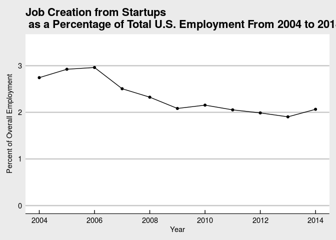

# Replication for: How Much Do Startups Impact Employment Growth in the U.S.?
Lars Vilhuber  
December 1, 2016  


# Source document
A blog post [http://researchmatters.blogs.census.gov/2016/12/01/how-much-do-startups-impact-employment-growth-in-the-u-s/](by Jim Lawrence)

# Source data
Data to produce a graph like this can be found at [https://www.census.gov/ces/dataproducts/bds/data_firm.html](). Users can look at the economy-wide data by age of the firm, where startups are firms with zero age:


# Creating Figure 1
We will illustrate how to generate Figure 1 using R. Users wishing to use Javascript, SAS, or Excel, or Python, can achieve the same goal using the tool of their choice. Note that we will use the full CSV file at [http://www2.census.gov/ces/bds/firm/bds_f_age_release.csv](), but users might also want to consult the [https://www.census.gov/data/developers/data-sets/business-dynamics.html](BDS API).


```r
bdsbase <- "http://www2.census.gov/ces/bds/"
type <- "f_age"
ltype <- "firm"
# for economy-wide data
ewtype <- "f_all"
```
We are going to read in two files: the economy wide file, and the by-firm-age file:

```r
# we need the particular type 
conr <- gzcon(url(
  paste(bdsbase,"/",ltype,"/bds_",type,"_release.csv",
        sep="")))
txt <- readLines(conr)
bdstype <- read.csv(textConnection(txt))
# the ew file
ewcon <- gzcon(url(
  paste(bdsbase,"/",ltype,"/bds_",ewtype,"_release.csv",
        sep="")))
ewtxt <- readLines(ewcon)
bdsew <- read.csv(textConnection(ewtxt))
```
We're going to now compute the fraction of total U.S. employment (`Emp`) that is accounted for by job creation from startups (`Job_Creation if fage4="a) 0"`):


```r
analysis <- bdsew[,c("year2","emp")]
analysis <- merge(x = analysis, y=subset(bdstype,fage4=="a) 0")[,c("year2","Job_Creation")], by="year2")
analysis$JCR_startups <- analysis$Job_Creation * 100 / analysis$emp
# properly name everything
names(analysis) <- c("Year","Employment","Job Creation by Startups", "Job Creation Rate by Startups")
```

# Create Figure 1

Now we simply plot this for the time period 2004-2014:
<!-- -->

